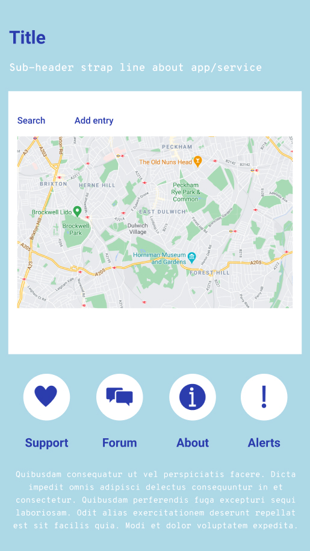
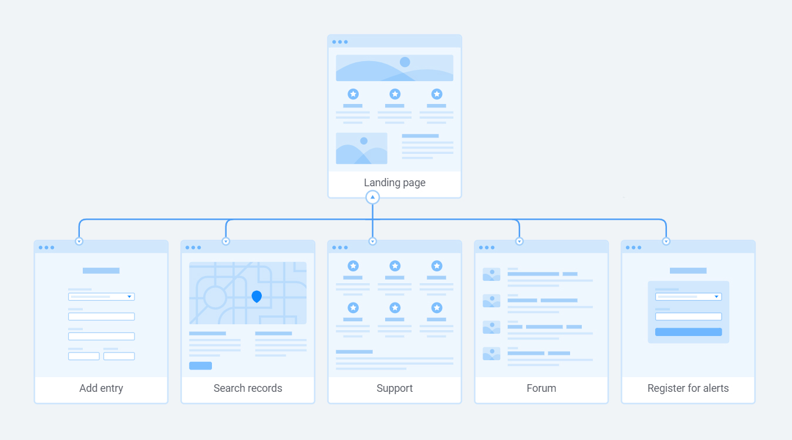

# Heads-Up

## Project summary
The purpose of this app is to act as a simple service and support tool for the victims of sexual assault and members of communities where attacks are known to have taken place anywhere in the world.
The objective is that everybody can use it and it can help as a way so that victims can help other community members as a way to prevent more sexual attacks and to make it easier to catch sexual offenders. We decided to make the project worldwide because there is nothing like this yet and because this could help especially migrants and refugees who are usually some of the most vulnerable members of society.
We chose the title "Heads-Up" because it makes sense in two ways:
* Firstly because a "heads-up" is a warning, or a message that alerts or prepares
* Also because sexual assault victims tend to feel shame and this is a way to empower them so that they can hold their heads up high.

## Features
* Interactive city map with markers showing attacks by location
* Users can contribute details of attack via submit form, which will take the date, time, location and description of attacker to store in database
* Users should be able to filter/search map to define location and date/time range
* Live data incorporated from police/news data sources (tbc)
* Support page with resources and contact information
* Alert tool allows users to register for text/email alerts of new attacks added close to user's location (tbc)
* Member's support forum (tbc)

## Technologies
* React
* JavaScript
* Css
* Express
* Leaflet (map) // npm add react-leaflet leaflet react-dom
* Open Cage (geocoding) // npm add opencage-api-client
* Police or news API (tbc)
* Package manager: NPM

## Backend
* (Database scheme to be added)
- Database of 'attacks' includes:
  - date
  - time
  - location
  - description
- Methods:
  - post method to add attack
  - get method to get all attacks
  - get method to get all attacks by location
  - get method to get all attacks by date(?)

## Design & user-flow
Landing page mock-up

Site map

User flow

_This is a student project that was created at [CodeOp](http://codeop.tech), a full stack development bootcamp in Barcelona._