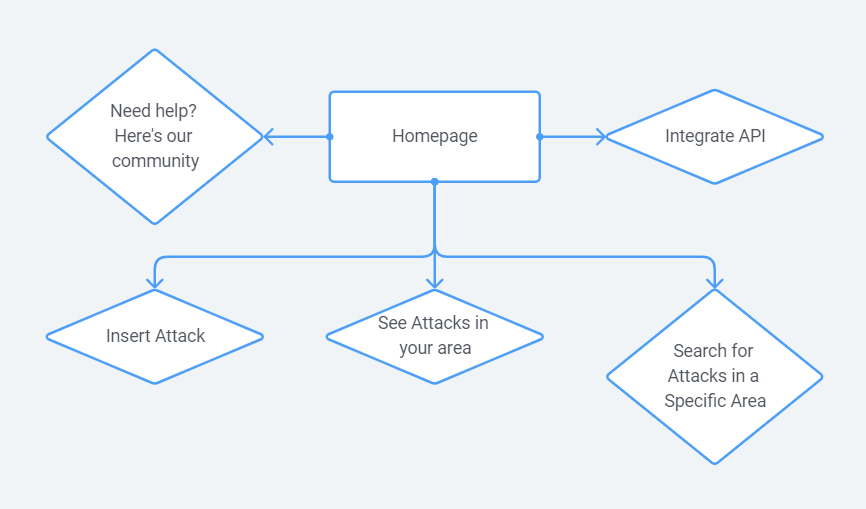

# FSPT3-Team1
Project title to be added once agreed.

## Project summary
The purpose of this app is to act as a simple service and support tool for both of victims of sexual assault and for members of communities where attacks are known to have taken place.

## Features
* Interactive city map with markers showing attacks by location
* Users can contribute details of attack via submit form, which will take the date, time, location and description of attacker to store in database
* Users should be able to filter/search map to define location and date/time range
* Live data incorporated from police/news data sources (tbc)
* Support page with resources and contact information
* Alert tool allows users to register for text/email alerts of new attacks added close to user's location (tbc)
* Member's support forum (tbc)

## Technologies
* React
* JavaScript
* Css
* Express
* Leaflet
* Police or news API (tbc)
* Package manager: NPM

## Backend
* (Database scheme to be added)
- Database of 'attacks' includes:
  - date
  - time
  - location
  - description
- Methods:
  - post method to add attack
  - get method to get all attacks
  - get method to get all attacks by location
  - get method to get all attacks by date(?)

## Design & user-flow
Landing page mock-up

Site map

User flow

_This is a student project that was created at [CodeOp](http://codeop.tech), a full stack development bootcamp in Barcelona._